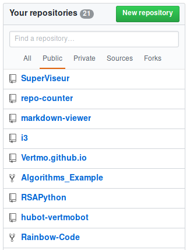
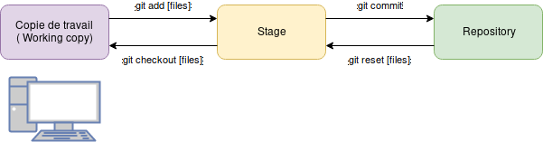

@title[Introduction]
## Applied Gitology
#### Git & GitHub pour les petits nouveaux

---
@title[Difference]
## Git ou GitHub ?
* Git -> Logiciel de gestion de versions (VCS), Linus Torvalds, 2006
* GitHub -> Site et service d'hebergement de repos Git, 2008

---
@title[Pourquoi ?]
## Pourquoi utiliser Git ?
* Historique des changements (VCS)
* Travail collaboratif
* Décentralisé (contrairement a SVN)

---
@title[Repositories]
## Repo ? Kezako ?
Un repository (dépot) contient tous les fichiers du projet + historique des changements (.git/)

---
@title[Commit]
## Commit
Plus petite unité de changement. Créer un commit : `git commit`

---
@title[Workflow de base]
## Quelques premières commandes

---
@title[Status]
## Help ! Je suis perdu
Pas de panique -> `git status`

